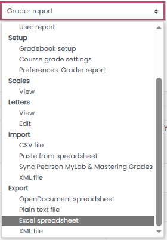

# Excel-to-eGrades

This tool is designed to help automate the process of transferring grades from Moodle to eGrades. It does so by taking an Excel file export of grades from Moodle, parsing it to extract relevant information, and generating a JavaScript file that can be run in your web browser to automatically fill in grades on the eGrades page.

## Prerequisites

Before running the script, make sure that you have the following software installed on your machine:

- Python 3.x
- Required Python libraries: pandas, pyperclip

## How to Use

### Step 1: Export Grades from Moodle

The first step is to export the grades from Moodle as an Excel spreadsheet. To do this, go to the 'Grades' tab, click on 'Grader report', and then choose to 'Export' as 'Excel spreadsheet'.



You can also follow the instructions provided in the [Moodle documentation](https://docs.moodle.org/402/en/Grade_export).

### Step 2: Run the Script

You have two options for running the script:

#### Option 1: Using the File Dialog

```bash
python excel_to_egrades.py --scale 10
```

The `scale` argument is optional and defaults to 1. This argument allows you to scale the grades if necessary. For example, if the total possible grade in Moodle is 100 but in eGrades it's 10, you would use a scale factor of 10.

A file dialog will appear. Select the Excel file that you exported from Moodle.

#### Option 2: Specifying the File Path

You can directly specify the file path as an optional argument to skip the file dialog. If you don't provide a file path, the script will automatically open a file dialog for you to choose the Excel file.

```bash
python excel_to_egrades.py --file "path/to/excel/file.xlsx"
```

### Step 3: Inject the JavaScript Code into eGrades

The script will generate a JavaScript file named 'inject_grades_[input_file_name].js' in the same directory as the input Excel file. It will also copy the contents of this file to your clipboard.

To use this JavaScript file:

1. Navigate to the eGrades page for the corresponding grades.
2. Open your browser's JavaScript console. In Chrome and Edge, you can do this by right-clicking on the page, selecting 'Inspect', and then navigating to the 'Console' tab.
3. Copy the contents of the generated JavaScript file (it will be in your clipboard after you run this script) and paste them into the console, then press Enter.

The JavaScript code will automatically fill in the grades in the eGrades page.
